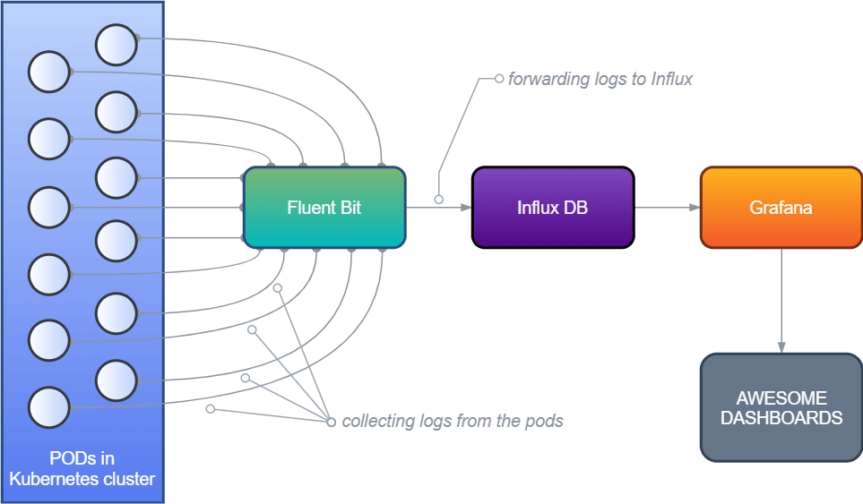

# <div align="center"> FIG stack</div>

<p align="center">A minimal logging architecture in Kubernetes
<br>
<strong>FluentBit + InfluxDB + Grafana ⎈ FIG</strong>
</p>




## TL;DR
Install FIG stack on your Kubernetes cluster
```bash
./install.sh
```

## Prerequisites
* [kubectl](https://kubernetes.io/docs/tasks/tools/install-kubectl/)
* [Helm 3](https://helm.sh/docs/intro/install/)

## Why FIG?
For a small Kubernetes cluster, I needed a minimal dashboard where logs from all the running applications in the Kubernetes environment can be viewed or `grep`ed from one place.
I thought about ELK (Elastic + Logstash + Kibana) first, but then I realized my small cluster has a config of only 2 nodes with a total 2 vCPU and 4GB RAM, which wouldn’t be a wise option for Elastic to run since it requires more resources to run smoothly. I wanted to use as few resources as possible to have the logging architecture setup.

#### Read more here: https://aniskhan001.me/tech/logging-with-fluent-bit-influxdb-fig


<sub>_Credit: [Fig icon](https://www.iconfinder.com/icons/4619630/fig_fruit_food_fruit_fruits_icon) by [sbts2018](https://www.iconfinder.com/sbts2018)_</sub>
